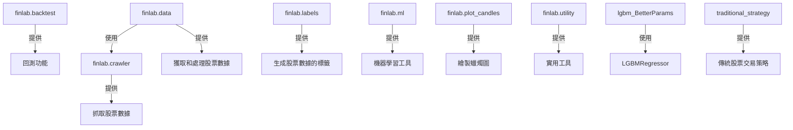

# tw_stock_predictor

## Dataset
### auto_update.py
download data from: https://www.twse.com.tw/exchangeReport/MI_5MINS_INDEX  
This file is responsible for automatically updating stock datafrom TWSE(Taiwan Stock Exchange).  
It utilizes finlab.crawler to fetch data. 

## traditional strategy
### traditional_strategy.py
calculate the deviation rate between the quarterly moving average and the daily chart.  
When the stock price is greater than one standard deviation above the deviation rate, buy it.  
When it's lower than one standard deviation below the deviation rate, sell it (buy high, sell low).  
At the same time, including the transaction fees of Taiwan Stock Exchange into the cost.  

## GradientBoost predictor
### GradientBoost.py 
This file uses GradientBoostingRegressor to predict stock prices. It first fetches data from finlab.data, performs feature engineering, and then trains the model.

### lgbm_BetterParams.py
use to optimize the parameters
compute the best parameters for GradientBoost to fit the data.
website: https://medium.com/@pushkarmandot/https-medium-com-pushkarmandot-what-is-lightgbm-how-to-implement-it-how-to-fine-tune-the-parameters-60347819b7fc

## RandomForest and traditional strategy predictor
### RandomForest.py
This file uses RandomForestRegressor to find the best features that influence stock the most. Then, combine them with tradition strategy.
theory: https://link.springer.com/content/pdf/10.1023/A:1010933404324.pdf

## Finlab

