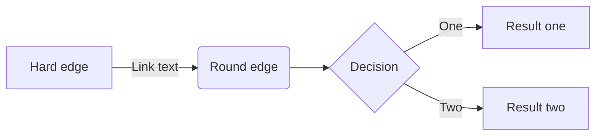

# tw_stock_predictor

## Dataset
download data from: https://www.twse.com.tw/exchangeReport/MI_5MINS_INDEX  
use auto_update.py to update the data from TWSE(Taiwan Stock Exchange).  
obtain the daily and intraday charts of the market  

## date_analysis predictor
calculate the deviation rate between the quarterly moving average and the daily chart.  
When the stock price is greater than one standard deviation above the deviation rate, buy it.  
When it's lower than one standard deviation below the deviation rate, sell it (buy high, sell low).  
At the same time, including the transaction fees of Taiwan Stock Exchange into the cost.  

## GradientBoost predictor
use GradientBoost.py to compute the result of lightgbm model.

### lgbm_BetterParams.py
use lgbm_BetterParams.py to compute the best parameters for GradientBoost fit the data.

## RandomForest predictor
use RandomForest.py to output the best features that influence stock the most. Then, combine them with tradition strategy.
